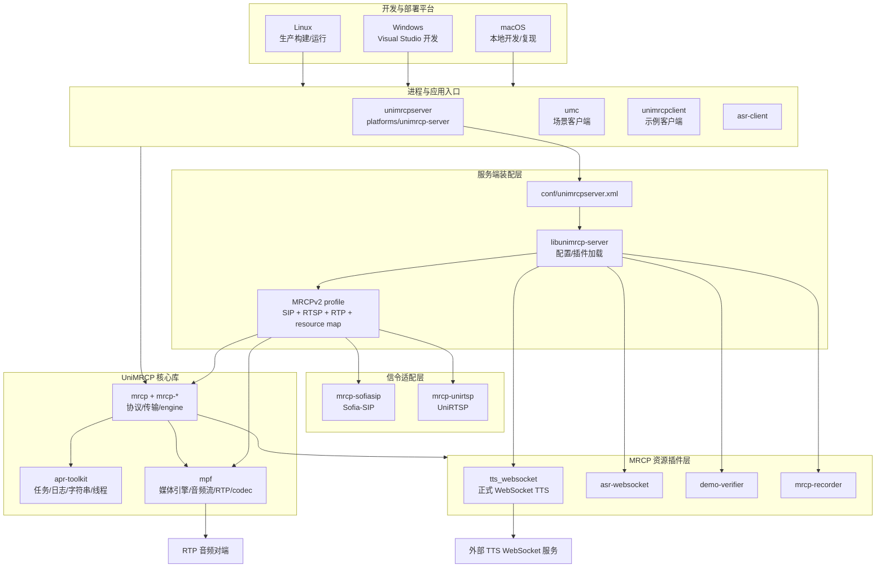

# TTE-MRCP Agent 工程治理与开发指南

本文件定义 TTE-MRCP 的工程边界、真实运行链路、变更路由和验证门禁。当前源码、构建文件和运行配置是事实来源；本文件与其冲突时，以当前源码为准并同步修订本文件。

## 1. SSOT 与事实等级

事实来源等级如下：

1. 当前 C/C++ 源码、头文件和测试源码。
2. `configure.ac`、`Makefile.am`、CMake 文件、Visual Studio 工程文件。
3. `conf/` 下实际被加载的 XML 配置和 `data/` 下测试输入。
4. 可复现的本机命令、测试输出和运行日志。
5. `README.md`、`docs/reports/`、`docs/superpowers/`、注释和归档文件。

历史报告、备份源码、生成物和旧日志属于非现行证据，不能证明当前行为；旧报告中的函数名、目录名和行号不覆盖当前代码。

代码发现必须优先使用 codebase-memory-mcp：`search_graph` → `trace_path` → `get_code_snippet` → `query_graph` → `get_architecture`。只有搜索字符串、配置值、非代码文件或图谱不足时，才回退到 `rg` 等文本搜索。

Shell 命令使用系统标准命令和项目实际可用工具；复杂命令应保持可读、可复现。禁止将 `$HOME`、`$CODEX_HOME` 或宽泛目录作为破坏性操作目标。

### 1.1 项目继承关系与开发重心

本项目基于开源 [UniMRCP](https://github.com/unispeech/unimrcp) 工程，遵循 Apache License 2.0。`libs/`、`modules/`、`platforms/`、`build/` 和基础 `conf/` 主要承载上游 UniMRCP 框架、协议、媒体、信令、构建和运行时装配能力。

本项目的开发代码和业务优化集中在 `plugins/`，其中正式 TTS 业务位于 `plugins/tts-websocket/`。插件目录是功能开发、并发优化、音频链路修复、外部服务适配和插件级测试的主要变更范围。

上游公共包存在可复现缺陷时，公共包修复属于受控例外，适用以下事实约束：

- 缺陷具有源码、测试或运行证据，且插件边界无法安全解决。
- 修改保持上游 API、ABI、协议和跨平台行为兼容；无证据的预防性重构不属于公共包修复。
- 变更记录包含受影响的上游包、根因、兼容性影响、测试结果和回合并风险。
- 插件变更与上游公共包变更在提交、报告和验收记录中分开标识。

变更优先级为：`plugins/` 业务实现与测试 → 插件依赖的局部适配 → 上游公共包的证据驱动修复。公共库不是插件逻辑的默认承载位置。

## 2. 项目整体架构

UniMRCP 的运行时分层如下：

```text
unimrcpserver / umc / unimrcpclient
        │
platforms：进程入口、配置装配、客户端/服务端应用
        │
modules：Sofia-SIP、UniRTSP 等信令适配
        │
libs：APR Toolkit、MPF 媒体、MRCP 协议、传输和 engine 框架
        │
plugins：MRCP 资源插件（TTS、识别、验证、录音）
```

现行代码图谱包含 4 个主要进程入口：

- `platforms/unimrcp-server/src/main.c`：服务端进程。
- `platforms/umc/src/main.cpp`：UMC 场景客户端。
- `platforms/unimrcp-client/src/main.c`：示例 MRCP 客户端。
- `platforms/asr-client/src/main.c`：ASR 客户端。

服务端配置装配由 `platforms/libunimrcp-server/src/unimrcp_server.c` 完成：读取 XML、创建 SIP/RTSP agent、media engine、RTP factory、resource engine map，并按 `<engine>` 加载插件。不要把 `platforms` 的进程入口、`libs` 的协议/媒体框架和 `plugins` 的业务资源实现混为一层。

### 2.1 技术架构图



图中“平台”是构建和部署边界，不是业务层；上游框架逻辑位于 `libs` 和 `modules`，本项目业务逻辑主要位于 `plugins`。接口变更的影响面包含对应配置、构建目标和运行时加载路径。

### 2.2 主要功能流程图

```mermaid
flowchart LR
    Start["unimrcpserver 启动"]
    Parse["读取 XML 配置\n创建 SIP/RTSP/RTP/media"]
    Load["plugin factory\n加载 tts_websocket.so/dll"]
    Ready["MRCPv2 profile 就绪"]
    Speak["客户端发送 SPEAK"]
    Dispatch["tts_websocket_channel_request_dispatch"]
    Session["tts_websocket_channel_speak\n校验 codec/清理旧会话"]
    Open["tts_websocket_start_streaming\n连接/握手/发送文本"]
    Service["TTS WebSocket 服务\n控制帧 + 二进制 PCM 帧"]
    Thread["tts_websocket_stream_thread\n接收与协议状态机"]
    Convert["24 kHz PCM\n重采样到 8 kHz + PCMU"]
    Ring["channel ring buffer\n锁/条件变量/生命周期"]
    MPFRead["tts_websocket_stream_read_safe\n按 MPF/RTP 帧读取"]
    RTP["RTP 音频输出"]
    Complete["post-roll/RTP drain\n发送 SPEAK-COMPLETE"]
    Stop["STOP/PAUSE/RESUME/错误\n停止线程并清理 socket/buffer"]

    Start --> Parse --> Load --> Ready --> Speak --> Dispatch --> Session --> Open --> Service
    Service --> Thread --> Convert --> Ring --> MPFRead --> RTP --> Complete
    Dispatch -.->|STOP/PAUSE/RESUME| Stop
    Thread -.->|协议/网络错误| Stop
    Stop --> Complete
```



主流程中 `SPEAK-COMPLETE` 仅表示 MRCP 会话完成，不证明 RTP 音频完整。杂音、静音和丢音的证据链为 `Service → Thread → Convert → Ring → MPFRead → RTP`，`Complete` 的触发原因单独记录。

### 2.3 跨平台部署基线

本项目必须同时支持以下三类环境，不能以单一操作系统的本机通过作为跨平台完成标准：

| 环境 | 角色 | 首选构建入口 | 交付要求 |
|---|---|---|---|
| macOS（Apple Silicon） | 本地开发、协议/单元测试、问题复现 | `tools/dev/setup_macos.sh`、Autotools、CMake | 可验证源码和依赖探测；不得把 `/opt/homebrew` 写入通用构建文件 |
| Windows（Win32/x64） | 本地开发、Visual Studio 编译和兼容性验证 | `unimrcp.sln`、`unimrcp-2010.sln`、对应 `.vcxproj`/`.props` | 至少验证目标架构、DLL 导出/加载、Winsock/线程和路径行为 |
| Linux（x86_64/目标生产架构） | 生产构建、部署和运行 | Autotools 为主，CMake 为辅 | 在目标发行版或兼容 sysroot 中构建并做动态库加载、RTP/MRCP 和 TTS 冒烟验证 |

跨平台开发必须遵守以下规则：

- 公共 C 代码优先使用 APR、UniMRCP 和现有抽象层提供的线程、socket、pool、文件和时间 API；不得在业务路径直接混用 pthread、Winsock、`kqueue`、`epoll` 或 macOS Framework API。
- 必须使用 `_WIN32`、`__APPLE__`、`__linux__` 等条件编译时，将分支限制在平台适配边界，并为每个平台提供可编译的对称路径；不能只在 macOS 分支实现功能。
- 路径、临时目录、动态库扩展名、环境变量和 shell 命令不得写死。`.so`、`.dll`、`.dylib` 只允许出现在平台构建/部署检查中，不能作为跨平台业务逻辑假设。
- CMake 的依赖必须由 `find_package`/`pkg-config`/toolchain 提供；Autotools 的依赖必须由 `configure` 的 host/build 检测提供；Visual Studio 依赖必须由 `.props` 或明确的 Windows 依赖说明提供。禁止把 Homebrew、Linux `/usr/lib` 或 Windows 用户目录写进共享源码。
- `tools/dev/setup_macos.sh` 和 `env-macos.sh` 仅适用于 macOS。Windows/Linux 入口使用独立脚本或文档，macOS 脚本不承担其他系统的环境探测。
- Unix shell 诊断脚本不属于 Windows 验证；Windows 诊断入口采用 PowerShell/MSBuild/CTest 等价工具，Linux 生产验证包含真实动态库加载和运行时配置检查。
- 任何“跨平台支持”结论都必须分别标记源码可移植性、构建可移植性和运行时可部署性；macOS 编译通过只能证明 macOS 这一层。

### 2.4 目录职责

| 目录 | 职责 | 变更注意 |
|---|---|---|
| `libs/apr-toolkit` | APR 封装、任务、日志、字符串、目录布局 | 高 fan-in 公共基础层，修改需扩大回归范围 |
| `libs/mpf` | 媒体引擎、音频流、RTP、codec | 音频时序和线程回调的核心层 |
| `libs/mrcp`、`libs/mrcp-*` | MRCP 消息、client/server/engine、传输 | 协议状态和响应事件的核心层 |
| `modules/mrcp-sofiasip`、`modules/mrcp-unirtsp` | SIP/RTSP 信令适配 | 端口、连接和 profile 变更需做联调 |
| `plugins/tts-websocket` | 正式 WebSocket TTS MRCP 插件 | 仅此目录承载正式 TTS 业务代码 |
| `plugins/asr-websocket`、`plugins/demo-verifier`、`plugins/mrcp-recorder` | ASR WebSocket 与其他资源插件 | `asr-websocket` 是正式 FunASR ASR 插件；`demo-verifier` 保留历史示例/兼容名称 |
| `platforms/libunimrcp-server` | 服务端装配和插件加载 | XML、engine、resource-map 变更必须检查这里 |
| `platforms/unimrcp-server`、`platforms/umc`、`platforms/unimrcp-client` | 可执行程序和场景驱动 | `demo_*` 示例客户端名称保留 |
| `conf` | 运行配置、场景和 profile | 以实际加载 XML 为准，检查 id 唯一性 |
| `build` | Autotools 必需的源码输入（宏、规则、pkg-config 模板） | `build/local` 才是本地生成目录，不要误删根目录源码输入 |
| `tools/dev` | 分平台依赖、环境和构建入口 | 现有 macOS 入口；Windows/Linux 入口独立命名，不写入全局配置 |
| `tools/stress`、`tools/diagnostics` | 压测和诊断 | 根目录同名脚本仅保留兼容包装 |
| `tests` | 框架测试、协议测试、集成测试 | 集成测试可能依赖已编译 UMC 和外部服务 |
| `docs/reports`、`docs/superpowers` | 报告、设计和实施记录 | 必须标注证据来源和当前性 |
| `.archive` | 低价值历史副本和生成物归档 | 不进入源码发现和图谱事实判断 |

## 3. 正式 TTS WebSocket 插件边界

正式插件的 canonical 命名是：

- 目录：`plugins/tts-websocket/`
- C 源码：`plugins/tts-websocket/src/tts_websocket_engine.c`
- Autotools/CMake 目标：`tts_websocket`
- 动态库：`tts_websocket.so`
- XML engine：`id="TTS-WebSocket-1" name="tts_websocket"`
- HTTP 协议单测：`plugins/tts-websocket/tests/test_tts_websocket_http_parse.c`

正式 ASR WebSocket 插件的 canonical 命名是：

- 目录：`plugins/asr-websocket/`
- C 源码：`plugins/asr-websocket/src/asr_websocket_engine.c`
- Autotools/CMake 目标：`asr_websocket`
- 动态库：`asr_websocket.so`
- XML engine：`id="ASR-WebSocket-1" name="asr_websocket"`
- FunASR endpoint 参数：`funasr-host`、`funasr-port`、`funasr-path`

历史 `Demo-Recog-1` / `demorecog` 仅作为迁移输入兼容处理，不属于正式产品定位；活动配置、构建、诊断和文档使用 canonical 名称。

`demo_*` 只允许出现在 UniMRCP 示例客户端或其他历史示例插件中。正式 TTS 插件代码不使用 `demo_synth_*`、`demosynth`、`Demo-Synth-1` 等旧命名。

现行 TTS 实际链路：

```text
MRCP SPEAK
  → tts_websocket_channel_request_dispatch
  → tts_websocket_channel_speak
  → tts_websocket_start_streaming
  → WebSocket handshake / send
  → tts_websocket_stream_thread
  → websocket_recv_frame
  → 24 kHz PCM → 8 kHz PCM → PCMU
  → channel ring buffer
  → tts_websocket_stream_read_safe
  → RTP 音频 + SPEAK-COMPLETE
```

### 3.1 音频与并发不变量

高并发、杂音、静音、丢音问题的验收同时包含“音频正确性”和“MRCP 完成状态”；`SPEAK-COMPLETE` 不构成音频正确性证明。

- WebSocket/TCP 读取必须允许 short read；不得假设一次 `recv` 得到完整帧头、payload 或 HTTP header。
- WebSocket frame 边界、fragment、Ping/Pong、Close 和握手后粘包必须分别记录和测试。
- PCM 处理必须维护跨帧 carry，不能丢弃奇数字节、半个采样或半个 codec frame。
- ring buffer 的写入、读取、满/空、关闭和错误状态必须有明确的锁与条件变量协议；不能用双重 `trylock` 失败路径静默返回。
- `stream_thread`、MPF read callback、channel destroy/cleanup 的生命周期必须可证明；先停线程，再关闭 socket/buffer，再释放资源。
- `SPEAK-COMPLETE` 只能在输出缓冲区、post-roll、RTP drain 和终止原因均满足协议时发送。
- 生产日志默认记录 session、首包延迟、帧间隔、读写字节数、丢弃数、静音帧数和完成原因；不要默认打印完整文本、hex dump 或逐帧 INFO 日志。

上述不变量对应独立的 WebSocket parser、PCM pipeline、ring buffer 和完成状态测试；压力测试退出码不构成唯一证据。

## 4. 变更路由

变更边界和联查范围如下：

| 需求 | 首选代码范围 | 必须联查 |
|---|---|---|
| TTS MRCP 方法/状态 | `plugins/tts-websocket/src/tts_websocket_engine.c` | MRCP engine API、MPF stream callback、XML engine |
| WebSocket framing/握手 | TTS 插件内协议函数和测试 | short read、fragment、control frame、错误关闭 |
| PCM/采样率/PCMU | TTS 插件音频函数、MPF codec | frame size、carry、RTP payload、录音结果 |
| 并发/生命周期 | TTS channel、stream thread、cleanup/destroy | mutex/cond、socket、线程 join、STOP/PAUSE/RESUME |
| MRCP/SIP/RTSP 协议 | `libs/mrcp*`、`modules/*` | server/client profile、端口和联调场景 |
| 插件加载/资源映射 | `platforms/libunimrcp-server`、`conf` | engine id 唯一、动态库存在、resource-engine-map |
| Autotools | `configure.ac`、`Makefile.am`、`build/acmacros` | `./bootstrap`、`./configure`、条件变量和安装路径 |
| CMake | 根 `CMakeLists.txt` 和对应子目录 | `pkg-config`、Apple Silicon 前缀、CMake policy |
| 压测/诊断 | `tools/stress`、`tools/diagnostics` | 根目录兼容包装、输出目录、日志敏感信息 |
| 工程治理 | `AGENTS.md`、`.gitignore`、`.archive` | 图谱索引、README、归档清单 |

局部插件问题不直接修改公共库；跨层修复以 `trace_path` 的调用链和边界证据为依据。

## 5. Agent 规范

### 5.1 任务输入与事实记录

1. 任务输入包含本文件、相关目录规则和用户指定的 SSOT。
2. `git status --short` 是已有工作区改动的记录入口，用户改动保持不变。
3. 代码入口、调用者和被调用者以图谱查询及精确源码片段为依据。
4. 结论分为“源码事实、测试/实验事实、线上事实、推断”，四类证据不混用。
5. 多文件变更具有设计记录和实施计划；单文件确定性修改不要求独立计划。

### 5.2 变更约束

- 每个提交/变更集保持单一目的；重命名、逻辑修复、生成物清理分开说明。
- 先改 SSOT（C 源码、`configure.ac`、`Makefile.am`、CMake、XML），再生成 `configure`/`Makefile.in`。
- 不手工编辑编译产物、`.o`、`.so`、`.la`、`.deps`、`.libs` 或运行日志来“修复”源码问题。
- 文件价值不确定时移动到 `.archive/repo-cleanup-YYYYMMDD/` 并生成中文归档清单；直接删除不属于默认治理动作。
- 外部服务、真实呼叫、邮件或发布操作必须保留人工确认点；本地静态检查不等于线上验证。

### 5.3 验证门禁

验收门禁包含与变更范围匹配的以下项目：

```sh
git diff --check
find tools -type f -name "*.sh" -print0 | xargs -0 bash -n
./tools/dev/setup_macos.sh
./bootstrap                 # configure.ac/Makefile.am/build 宏变化时适用
./configure --help
cmake -S . -B /tmp/tte-mrcp-cmake -DCMAKE_POLICY_VERSION_MINIMUM=3.5
```

上面的 `tools/dev` 和 Homebrew 命令是 macOS 开发验证，不是 Linux 生产构建命令，也不是 Windows 验证命令。跨平台任务必须按目标环境补充：Windows 使用对应 Visual Studio solution、MSBuild/CTest 和 DLL 加载检查；Linux 使用目标发行版的 Autotools/CMake 构建、插件加载和服务启动冒烟测试。

代码、配置或目录变更的验收记录包含 codebase-memory-mcp `index_repository` 结果、`search_graph` 的 canonical 节点和关键调用链，以及各命令的结果和未通过原因。

### 5.4 Issue → 分支 → PR 交付流程（强制）

所有需要提交到远程仓库的代码、配置、测试和工程文档变更，必须严格遵循以下流程：

1. **Issue**：先有可追踪的 Issue 或任务编号；没有编号时先创建或获取 Issue，不得直接以临时分支替代需求记录。
2. **分支**：从最新 `main` 创建专用分支，命名为 `<type>/issue-<number>-<short-slug>`，例如 `fix/issue-943-terminal-cleanup`、`docs/issue-120-root-layout`。禁止在 `main`、`master` 或其他默认保护分支上提交变更。
3. **提交**：只暂存当前 Issue 范围内的文件；提交信息使用 Conventional Commits，并在提交正文或 footer 中关联 Issue。
4. **验证**：提交前运行与变更范围匹配的验证门禁，并检查 `git diff --check`、暂存区内容和敏感文件。
5. **推送分支**：只能推送 Issue 分支，例如 `git push -u origin <issue-branch>`；严禁执行 `git push origin main`、`git push origin master` 或向默认分支直接推送。
6. **PR**：从 Issue 分支创建 PR，目标为 `main`，PR 必须包含变更范围、验证结果、已知阻断和 Issue 关联（例如 `Closes #123`）。代码通过审核和保护规则后，才能由合并流程进入 `main`。
7. **清理**：PR 合并并确认远程 `main` 包含目标提交后，才删除本地和远程 Issue 分支；未合并分支不得清理。

该流程不因“改动很小”“只改文档”“需要尽快发布”或“用户要求 push all”而豁免。紧急修复也必须使用 Issue 分支和 PR；本项目不允许直接 push `main`/`master`。如果缺少 Issue 编号、目标分支、远程权限或 PR 审核条件，停止发布并报告阻断，不得自行绕过。

## 6. 测试与证据门禁

### 最低门禁

- Shell：`bash -n`。
- Python/XML：语法解析和目标配置加载检查。
- C 协议单测：对应插件测试通过；TTS HTTP parser 测试基线为 13/13。
- 引用检查：旧插件名、旧路径、动态库名和 XML engine id 不得出现在活动源码/配置中；示例客户端 `demo_*` 是允许的例外。
- 构建配置：Autotools `configure` 和 CMake configure 均通过；仅支持单一构建系统的平台记录对应通过项。
- 变更卫生：`git diff --check` 通过，归档清单和 `.gitignore` 与实际目录一致。

### 跨平台最低交付矩阵

- macOS：依赖脚本、Autotools/CMake 配置和协议单测通过；记录 Apple Silicon/Homebrew 只是开发环境事实。
- Windows：声明支持的 Win32/x64 目标完成编译；检查 `tts_websocket` DLL 产物、依赖 DLL、路径分隔符、线程/socket 行为和 XML 配置加载。
- Linux：在生产目标发行版或等价容器/sysroot 中编译；检查 `tts_websocket.so`、ELF 依赖、RPATH/`LD_LIBRARY_PATH`、动态插件加载、RTP/MRCP 建链和 TTS WebSocket 冒烟。
- 无法执行的平台标记为“未验证”，其他平台结果不替代该状态。

### 音频问题专项门禁

必须覆盖合法 short read、跨帧边界、奇数字节、空帧、连接关闭、ring buffer 满/空、STOP 竞态和 cleanup 竞态。压力测试必须同时保存：请求数、成功数、完成数、有效音频字节、静音帧、丢帧、异常关闭和首包/帧间隔统计。

### 已知环境基线

Apple Silicon 开发机依赖由 `tools/dev/setup_macos.sh` 和 `tools/dev/env-macos.sh` 管理，依赖路径由 Homebrew 前缀和 `pkg-config` 推导，`/usr/local/opt` 不属于共享构建配置。完整 Autotools 编译的已知阻断为 `libs/mpf` 中 `JB_TRACE/RTP_TRACE` 与 `mpf_null_trace()` 的宏签名不兼容；该阻断属于独立基线问题，不归因于 TTS 改名或依赖探测。

## 7. 文档、图库与归档

- README 只记录可复现入口和已验证事实；架构结论放在 `docs/reports/`，设计决策放在 `docs/superpowers/`。
- 文档中的路径、目标名、版本和行号必须回到当前源码复核；过期报告应标注“历史/非 SSOT”。
- 图库索引应覆盖活动源码、构建文件和配置；`.archive`、`var`、`.git`、`.vscode`、`build/local` 不作为活动代码事实。
- 发现旧图谱节点但活动路径已不存在时，报告中区分“图谱历史元数据”和“当前文件系统事实”，不要假称已经删除图谱历史节点。
- 归档只处理低价值生成物、备份和日志；正式源码、构建输入、测试夹具和当前配置不能归档。

## 8. 交付验收定义

交付验收项如下：

- 变更范围和不变边界明确。
- 当前源码、构建配置、XML 和文档引用同步。
- 用户已有改动保持不变，生成物未被当作源码。
- 关键测试和配置解析结果具备准确失败归因。
- TTS 音频正确性与 MRCP 完成状态分别验证。
- `git diff --check` 通过。
- codebase-memory 已重新索引并记录关键节点查询结果。
- README、报告、计划和归档清单反映最终状态。
