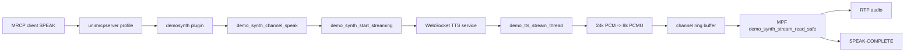
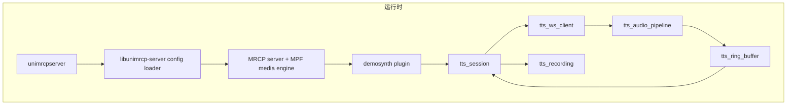

# TTE-MRCP 技术架构分析报告

日期：2026-08-04

范围：`/Users/huangzhonghui/tte-mrcp`

原则：以当前代码为 SSOT。文档、注释和历史备份只作为线索，不作为事实来源；凡是架构结论均回到当前源码、构建文件或配置文件确认。

## 1. 结论摘要

这个项目的运行时架构本身并不是完全混乱。它仍保留 UniMRCP 的典型分层：`platforms` 负责进程入口和装配，`libs` 提供 MRCP/MPF/APT 等框架库，`modules` 提供 SIP/RTSP 信令适配，`plugins` 提供 MRCP 资源引擎。根构建文件也明确把一级模块限定为 `build conf data libs modules plugins platforms`，测试套件按开关追加，见 `Makefile.am:26-29`。

真正造成“结构乱”的主要原因有三类：

1. 仓库治理混乱：生成物、日志、动态库、对象文件和源码混放；`src/bak` 里保留多版历史代码，导致同名函数在代码图谱和人工搜索中出现多个候选。
2. 本地 TTS 插件边界失控：`plugins/demo-synth/src/demo_synth_engine.c` 一个文件同时承担 MRCP 插件入口、通道状态机、MPF 音频回调、WebSocket 客户端、JSON 字符串处理、编码转换、录音和诊断统计。
3. 并发链路被塞进示例插件形态：SPEAK 请求在插件消费者任务内同步做 DNS、TCP connect、WebSocket handshake 和首批发送，然后另起线程接收音频，MPF 线程再从环形缓冲区读出。这条链路可以工作，但模块边界不清，故障隔离和压测定位成本高。

## 2. 当前真实架构

### 2.1 构建与模块边界

根构建入口：

- `Makefile.am:26` 定义固定构建顺序：`build conf data libs modules plugins platforms`。
- `Makefile.am:27-29` 说明 `tests` 只在 `TEST_SUITES` 条件成立时进入构建。
- `configure.ac:140-188` 分别控制 client/server 库和示例应用。
- `configure.ac:190-208` 分别控制 `demosynth`、`demorecog`、`demoverifier`、`recorder` 插件。
- `configure.ac:220-245` 生成 `libs`、`modules`、`plugins`、`platforms` 下各模块的 Makefile。

插件构建入口：

- `plugins/Makefile.am:5-18` 根据 configure 开关选择具体插件目录。
- `plugins/demo-synth/Makefile.am:3-6` 表明 TTS 插件产物是 `demosynth.la`，实际源文件只有 `src/demo_synth_engine.c`。

因此，运行时核心不是 `src/bak`，也不是根目录下的脚本和日志；当前 TTS 插件的编译入口只有 `plugins/demo-synth/src/demo_synth_engine.c`。

### 2.2 服务端装配路径

`platforms/unimrcp-server/src/main.c` 是 server 进程入口：

- `main` 初始化 APR、创建 pool、解析参数，见 `platforms/unimrcp-server/src/main.c:150-197`。
- 它加载目录布局和日志配置，见 `platforms/unimrcp-server/src/main.c:199-240`。
- 最后按前台/后台/命令行模式运行服务，见 `platforms/unimrcp-server/src/main.c:242-263`。

真正装配 MRCP server 的逻辑在 `platforms/libunimrcp-server/src/unimrcp_server.c`：

- `unimrcp_server_start` 创建 server、加载配置、启动 server，见 `platforms/libunimrcp-server/src/unimrcp_server.c:67-94`。
- resource factory 从 XML 读取 `<resource>` 并加载 MRCP 资源，见 `platforms/libunimrcp-server/src/unimrcp_server.c:246-287`。
- media engine 从 XML 创建 MPF engine 并注册，见 `platforms/libunimrcp-server/src/unimrcp_server.c:587-611`。
- plugin factory 遍历 `<engine>` 并加载动态插件，见 `platforms/libunimrcp-server/src/unimrcp_server.c:668-760`。
- MRCPv2 profile 将 SIP agent、MRCPv2 connection agent、media engine、RTP factory、RTP settings 和 resource-engine-map 组合起来，见 `platforms/libunimrcp-server/src/unimrcp_server.c:978-1032`。

配置中的装配对象在 `conf/unimrcpserver.xml`：

- resource factory 启用 `speechsynth`、`speechrecog`、`recorder`、`speakverify`，见 `conf/unimrcpserver.xml:28-34`。
- MRCPv2 connection agent 监听 `1544`，连接上限和缓冲配置在 `conf/unimrcpserver.xml:88-103`。
- media engine 和 RTP factory 在 `conf/unimrcpserver.xml:105-120`。
- plugin factory 启用 `demosynth` 并配置 TTS 服务 `40.20.85.37:8091`，见 `conf/unimrcpserver.xml:122-127`。

### 2.3 TTS 插件运行路径

TTS 插件入口和对象模型：

- 插件必须实现 `mrcp_plugin_create`，并且注释明确 MRCP channel callback 和 MPF stream callback 不应阻塞，见 `plugins/demo-synth/src/demo_synth_engine.c:17-28`。
- engine vtable 注册 destroy/open/close/channel_create，见 `plugins/demo-synth/src/demo_synth_engine.c:59-70`。
- channel vtable 注册 destroy/open/close/request_process，见 `plugins/demo-synth/src/demo_synth_engine.c:73-84`。
- audio stream vtable 把 MPF 读回调指向 `demo_synth_stream_read_safe`，见 `plugins/demo-synth/src/demo_synth_engine.c:86-101`。
- `demo_synth_channel_t` 中聚合 MRCP 请求、STOP 响应、WebSocket socket、接收线程、环形缓冲区、同步对象、诊断计数器、PCM 累积区和录音文件，见 `plugins/demo-synth/src/demo_synth_engine.c:118-225`。

SPEAK 请求路径：

- `demo_synth_channel_request_dispatch` 根据 method_id 分发，SPEAK 进入 `demo_synth_channel_speak`，见 `plugins/demo-synth/src/demo_synth_engine.c:2386-2424`。
- `demo_synth_channel_speak` 清理残留音频、校验 8k codec、打开录音、调用 `demo_synth_start_streaming`，见 `plugins/demo-synth/src/demo_synth_engine.c:2166-2210`。
- 流启动成功后先发送 INPROGRESS 响应，再设置 `speak_request`，见 `plugins/demo-synth/src/demo_synth_engine.c:2211-2222`。

WebSocket 和音频流路径：

- `demo_synth_start_streaming` 分配 512KB 环形缓冲区，创建 mutex/cond，转换文本编码，创建 socket，解析地址，连接 TTS 服务，执行 WebSocket 握手，发送 `session.config`、`input.text`、`input.done`，最后创建接收线程，见 `plugins/demo-synth/src/demo_synth_engine.c:1100-1330`。
- 接收线程 `demo_tts_stream_thread` 分配 2MB 接收缓冲区和每帧临时 pool，循环调用 `websocket_recv_frame`，按文本帧控制状态，按二进制帧处理 PCM，见 `plugins/demo-synth/src/demo_synth_engine.c:549-640`、`plugins/demo-synth/src/demo_synth_engine.c:667-837`。
- 二进制音频按 24kHz 16-bit PCM 处理，经过 24k -> 8k 重采样、16-bit PCM -> PCMU 转换，再写入环形缓冲区，见 `plugins/demo-synth/src/demo_synth_engine.c:870-891`、`plugins/demo-synth/src/demo_synth_engine.c:936-966`。
- MPF 读回调 `demo_synth_stream_read_safe` 从环形缓冲区读取固定大小 PCMU 帧，处理 post-roll、RTP drain 和 SPEAK-COMPLETE，见 `plugins/demo-synth/src/demo_synth_engine.c:2530-2768`。

可以把核心链路简化为：

## 3. 架构问题清单

### P0：源码、备份、生成物混在同一个搜索空间

当前仓库中可见多类不应作为源码入口的文件：

- `plugins/demo-synth/src/bak` 和 `plugins/demo-recog/src/bak` 共 15 个历史备份文件。
- 根目录和源码目录下存在 `Makefile`、`config.status`、`config.log`、`.o`、`.lo`、`.la`、`.so`、`.libs`、`.deps` 等生成物。
- 代码图谱查询 `demo_synth_channel_speak` 时出现 7 个候选，根因是当前源码和 `src/bak` 多版历史函数同名。

影响：

- 代码发现不可靠，搜索结果容易命中历史代码。
- 静态分析、代码图谱和人工 review 都会被污染。
- 新人无法快速判断“哪个文件是真正编译进产物”。

建议：

- 把 `plugins/*/src/bak` 移到仓库外归档，或至少移出 `src`，并在代码图谱、CI、搜索规则里排除。
- 补齐 `.gitignore`，排除 `*.o`、`*.lo`、`*.la`、`.libs/`、`.deps/`、`Makefile`、`config.status`、`config.log`、`plugin/*.so`、运行日志和 `.DS_Store`。
- 建立“运行源码清单”：对 TTS 插件明确声明只有 `plugins/demo-synth/src/demo_synth_engine.c` 被 `plugins/demo-synth/Makefile.am:5` 编译。

### P0：TTS 插件单文件职责过载

`demo_synth_engine.c` 当前至少承担 8 类职责：

- MRCP 插件入口和 vtable：`plugins/demo-synth/src/demo_synth_engine.c:59-101`、`plugins/demo-synth/src/demo_synth_engine.c:1349-1398`。
- channel 生命周期和请求分发：`plugins/demo-synth/src/demo_synth_engine.c:1553-1616`、`plugins/demo-synth/src/demo_synth_engine.c:2386-2424`。
- SPEAK 业务流程：`plugins/demo-synth/src/demo_synth_engine.c:2166-2252`。
- MPF 实时读回调：`plugins/demo-synth/src/demo_synth_engine.c:2530-2768`。
- WebSocket 客户端协议：`plugins/demo-synth/src/demo_synth_engine.c:3577-4136`。
- PCM 重采样和 PCMU 转换：`plugins/demo-synth/src/demo_synth_engine.c:1940-2149`。
- JSON 字符串处理和编码转换：`plugins/demo-synth/src/demo_synth_engine.c:3101-3318`。
- 录音与诊断统计：`plugins/demo-synth/src/demo_synth_engine.c:1620-1780`、`plugins/demo-synth/src/demo_synth_engine.c:180-225`。

影响：

- MRCP 状态机、网络协议、音频格式和诊断逻辑相互耦合。
- 并发问题修复容易引入音频格式或完成事件时序回归。
- 无法对 WebSocket framing、ring buffer、PCM 对齐等核心逻辑做低成本单元测试。

建议拆分为 6 个内部模块：

- `demo_synth_engine.c`：只保留插件入口、engine/channel vtable、MRCP 方法分发。
- `tts_session.c/h`：维护 SPEAK 会话状态、STOP/PAUSE/RESUME、完成事件。
- `tts_ws_client.c/h`：WebSocket 连接、握手、send/recv frame、控制帧。
- `tts_audio_pipeline.c/h`：PCM 累积、重采样、PCMU 转换。
- `tts_ring_buffer.c/h`：SPSC ring buffer 和同步策略。
- `tts_recording.c/h`：诊断录音和统计落盘。

### P0：SPEAK 启动路径同步阻塞插件消费者任务

`demo_synth_channel_request_dispatch` 在消费者任务里调用 `demo_synth_channel_speak`，见 `plugins/demo-synth/src/demo_synth_engine.c:2386-2399`。`demo_synth_channel_speak` 内部直接调用 `demo_synth_start_streaming`，见 `plugins/demo-synth/src/demo_synth_engine.c:2206-2210`。而 `demo_synth_start_streaming` 在返回前执行 socket create、DNS/地址解析、TCP connect、WebSocket handshake、三条 WebSocket 消息发送和线程创建，见 `plugins/demo-synth/src/demo_synth_engine.c:1247-1320`。

这意味着高并发时，插件唯一 consumer task 会被外部网络启动过程串行拖慢。虽然 WebSocket 接收已放到独立线程，但“启动请求”仍在消费者任务内同步完成。

建议：

- `demo_synth_channel_speak` 只完成参数校验和状态初始化，然后投递到 per-channel worker 或连接池任务。
- 启动成功/失败再异步回 MRCP INPROGRESS 或失败响应。
- 如果保留当前结构，至少把 DNS/connect/handshake 的耗时、失败码、队列等待时长打成结构化指标。

### P0：WebSocket 协议实现仍是手写低层状态机

当前 `websocket_handshake` 只用一个 1024 字节 buffer 接收握手响应，见 `plugins/demo-synth/src/demo_synth_engine.c:3591-3634`；它没有显式维护 HTTP header buffer，也没有处理 `\r\n\r\n` 后紧跟的首个 WebSocket frame。

`websocket_recv_frame` 虽然对 payload 做了循环读取，但帧头、扩展长度、Ping/Pong、Close、masked/unmasked 处理都集中在一个函数内，见 `plugins/demo-synth/src/demo_synth_engine.c:3818-4136`。同时，函数读取了 `is_fin`，但没有完整处理 continuation frame，见 `plugins/demo-synth/src/demo_synth_engine.c:3845-3847`。

影响：

- 协议边界错误会直接表现为音频错位、静音、丢帧或连接异常。
- 这类问题和 TTS 服务质量、MPF 发送时序混在一起，很难在线上日志中区分。

建议：

- 把 WebSocket 读写改成独立模块，提供 `read_exact`、HTTP header parser、frame parser、control frame handler、continuation assembler。
- 客户端发出的 Close/Pong 必须走统一 masked send 逻辑。
- 对帧解析做本地 fixture 测试：短读、粘包、fragment、ping with payload、超大 payload、握手响应后紧跟 frame。

### P1：配置存在重复 engine id 风险

`conf/unimrcpserver.xml` 中 `Demo-Recog-1` 出现两次：一次是空配置引擎，见 `conf/unimrcpserver.xml:128`；一次是带 FunASR 参数的引擎，见 `conf/unimrcpserver.xml:131-135`。server loader 会遍历每个 `<engine>` 并调用 `unimrcp_server_plugin_load`，见 `platforms/libunimrcp-server/src/unimrcp_server.c:747-756`。

影响：

- 取决于底层注册逻辑，同 id 可能覆盖、失败或产生难以解释的运行行为。
- 即使当前问题聚焦 TTS，这种配置重复也会降低整体服务可解释性。

建议：

- 删除重复的 `Demo-Recog-1`，保留唯一 id。
- 为配置加启动前 lint：检查 engine id 唯一、resource-engine-map 可解析、plugin 文件存在、端口和 buffer 参数合法。

### P1：JSON 处理仍是手写字符串解析

当前代码已经把消息 `type` 提取封装成 `json_get_type`，见 `plugins/demo-synth/src/demo_synth_engine.c:3196-3259`。但其他字段仍在 `demo_tts_stream_thread` 里用 `strstr`、`strchr`、`atoi` 提取，如 `sentence_index`、`sentence_text`、`format`、`sample_rate`、`error`，见 `plugins/demo-synth/src/demo_synth_engine.c:702-792`。

影响：

- 字段顺序、转义字符、嵌套结构、字符串中包含字段名等情况都可能误解析。
- 解析逻辑嵌在音频接收线程里，错误处理会影响音频状态机。

建议：

- 引入轻量 C JSON parser，或至少把当前字段解析封装成独立模块并加 fixture 测试。
- 音频线程只消费解析后的事件：`AUDIO_START`、`AUDIO_DONE`、`SESSION_DONE`、`ERROR`、`BINARY_AUDIO`。

### P1：热路径日志过多，且包含请求体和音频时序细节

当前 SPEAK 路径会对请求体做 hex dump，见 `plugins/demo-synth/src/demo_synth_engine.c:2196-2197`；WebSocket 发送 input.text 时记录完整请求体和原始文本，见 `plugins/demo-synth/src/demo_synth_engine.c:1292-1300`；接收线程每帧都有 INFO/DEBUG 级日志，见 `plugins/demo-synth/src/demo_synth_engine.c:638-640`、`plugins/demo-synth/src/demo_synth_engine.c:669-680`、`plugins/demo-synth/src/demo_synth_engine.c:840-864`。

影响：

- 高并发下日志 I/O 会放大调度延迟。
- 请求文本可能包含敏感业务内容，不宜长期以 INFO 级别输出。

建议：

- 默认关闭请求体、hex dump、逐帧日志，只保留 session 级 summary。
- 通过配置开关按 session_id 采样开启深度诊断。
- 把诊断指标结构化：首包延迟、最大帧间隔、ring written/read/dropped、trylock fail、silence frames、completion cause。

## 4. 推荐目标架构

推荐保持 UniMRCP 原生框架边界，只治理本地插件和仓库结构。

目标边界：

- UniMRCP 上游框架少改或不改。
- 本地业务逻辑集中在 `plugins/demo-synth` 内部模块。
- WebSocket、音频转换、ring buffer、MRCP 状态机分别可单测。
- 诊断能力保留，但默认不污染热路径。

## 5. 分阶段整改建议

### 第一阶段：仓库治理，低风险高收益

1. 新增 `.gitignore`，排除构建产物、运行日志、动态库、`.DS_Store`。
2. 把 `plugins/*/src/bak` 移出源码树，或重命名到 `archive/` 并从索引、CI、构建、代码图谱中排除。
3. 明确当前运行源码清单：server 入口、loader、demosynth 插件、关键配置。
4. 配置 lint：检查重复 engine id、plugin 文件存在、TTS host/port 合法。

### 第二阶段：TTS 插件内部拆分

1. 先抽 `tts_ring_buffer.c/h`，保持行为不变，补齐 ring buffer 单测。
2. 再抽 `tts_audio_pipeline.c/h`，覆盖奇数字节、跨帧累积、24k->8k、PCMU 转换。
3. 再抽 `tts_ws_client.c/h`，增加 WebSocket 短读、粘包、fragment、control frame 测试。
4. 最后收敛 `demo_synth_engine.c`，只保留 MRCP vtable、请求分发和 session 生命周期协调。

### 第三阶段：并发模型收敛

1. SPEAK 请求不在 consumer task 内同步完成 DNS/connect/handshake。
2. 引入 per-channel session worker，或者建立连接池/异步启动任务。
3. MPF read callback 不做任何可能等待的操作；ring buffer 读路径只做无阻塞状态判断。
4. 所有跨线程状态只通过 mutex 或 APR atomic 暴露，不再依赖 `volatile` 表达同步语义。

### 第四阶段：观测与验收

1. 压测验收不能只看 SPEAK-COMPLETE，需要验证音频连续性、总样本数、尾音、静音比例、错位杂音。
2. 每个 session 输出一条 summary 指标，避免逐帧日志淹没问题。
3. 建议最小验收集：
   - 50/100/200 并发 SPEAK。
   - 短文本、长文本、多句文本、中文 GBK/UTF-8。
   - TTS 服务端分片返回、短读、ping、fragment、首帧延迟、session.done 后残余 PCM。
   - STOP/barge-in 场景。

## 6. 优先级排序

| 优先级 | 事项 | 原因 | 风险 |
|---|---|---|---|
| P0 | 清理/隔离 `src/bak` 和构建产物 | 直接污染搜索、图谱和人工判断 | 低 |
| P0 | 拆出 WebSocket parser 并补测试 | 协议边界错误会直接变成音频问题 | 中 |
| P0 | SPEAK 启动链路从 consumer task 解耦 | 高并发下串行网络启动拖慢全局请求处理 | 中 |
| P1 | 拆 ring buffer/audio pipeline | 降低并发和音频格式问题互相影响 | 中 |
| P1 | 配置 lint，修复重复 engine id | 降低启动和运行时歧义 | 低 |
| P1 | 日志降噪和敏感文本保护 | 降低高并发 I/O 干扰和合规风险 | 低 |

## 7. 本次分析证据来源

- 代码知识图谱：项目索引包含约 1.2 万节点、4.2 万关系；图谱显示 `demo-synth`、`demo-recog`、server/client loader、UMC 等为主要簇，同时 `docs` 和 `bak` 对发现结果有污染。
- 当前源码和构建文件：
  - `Makefile.am`
  - `configure.ac`
  - `plugins/Makefile.am`
  - `plugins/demo-synth/Makefile.am`
  - `conf/unimrcpserver.xml`
  - `platforms/unimrcp-server/src/main.c`
  - `platforms/libunimrcp-server/src/unimrcp_server.c`
  - `plugins/demo-synth/src/demo_synth_engine.c`

## 8. 结论

项目“乱”的根因不是 UniMRCP 原生架构不可理解，而是本地改造缺少工程边界：运行源码、历史备份、生成物、诊断脚本和线上修复痕迹混在一起；TTS 插件又把网络协议、音频处理、MRCP 状态机和诊断逻辑都塞进一个 C 文件。

短期最有效的动作是先治理仓库可见结构和搜索空间，再按 WebSocket、ring buffer、audio pipeline、session state 四个方向拆 TTS 插件。这样既不会大范围改动 UniMRCP 上游框架，又能把高并发音频问题的修复面收敛到可测试、可回归的模块边界内。
