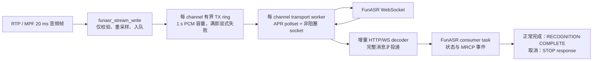

# Issue #2：ASR 高并发音频帧间隔异常——解决方案 Spec

## 1. 背景与目标

[Issue #2](https://github.com/hrygo/tte-mrcp/issues/2) 报告：在约 20 个并发 ASR 会话时，部分会话在 MRCP 服务端观测到的上游音频帧间隔从预期的 20 ms 增至超过 3 秒；音频最终完整，但识别显著延迟。低并发与基于文件的现有压测不能稳定复现。

本变更的目标是让一个 FunASR WebSocket 会话的网络慢、服务器分片响应、日志 I/O 或关闭等待，均不能阻塞 MPF 音频写回调，从而不再拖慢其他会话的 20 ms 媒体节拍。

不在本变更中重命名 `demo-recog`、改变 MRCP profile/engine id、修改 SIP/RTSP/RTP 公共库，或改变 FunASR 的 URL、音频格式和空二进制结束帧协议。

## 2. 证据与根因判断

### 2.1 Issue 事实（线上证据）

- 约 20 并发时持续出现，受影响会话具有选择性；并发降低后恢复。
- MRCP 服务端记录到音频包间隔大于 3 秒；音频未丢失，WebSocket 没有关闭或错误记录。
- LAN 带宽、CPU 和内存没有耗尽证据；现有文件压测未复现。

这些事实说明了现象和触发区间，**尚不足以单独证明某一个函数是唯一根因**。

### 2.2 当前源码事实

| 位置 | 事实 | 风险 |
|---|---|---|
| `plugins/demo-recog/src/demo_recog_engine.c:838` | `funasr_stream_write` 是 MPF sink 的音频回调，并对每一帧发出 `APT_PRIO_INFO` 日志。 | 20 会话、20 ms 一帧约为 1,000 条音频日志/秒；日志锁、格式化、磁盘或标准错误输出可占用媒体回调。 |
| `...:838` → `...:2048` → `...:1847` | 同一回调每积累 200 ms 音频便同步调用 `apr_socket_send`。socket 在 `...:1706` 配置为 5 秒超时。 | 任一会话的内核发送缓冲满或上游反压，可在媒体回调中停留至超时。 |
| `...:838` → `...:709` → `...:2442` | `funasr_process_realtime_response` 在回调内调用名为 `funasr_websocket_recv_nonblock` 的函数。该函数只把前两个 header 字节设为非阻塞读取，成功后在 `...:2467` 恢复原来的 5 秒超时，并循环读取扩展长度、mask、payload。 | 上游将 WebSocket header/payload 分片发送时，回调仍可能阻塞，且该路径会关闭部分读取失败的连接。 |
| `...:901` | 收到 STOP 后，`funasr_stream_write` 直接将 socket 超时设为 5 秒并等待最终识别结果。 | STOP 处理依赖下一次媒体回调，且把网络等待放入媒体路径。 |
| `...:709`、`...:2442` | 实时响应会输出 hex dump、原文并直接 `fwrite(stderr)`；响应解析/完成事件也发生在媒体回调。 | 高并发下增加了同步 I/O 和跨层状态修改。 |
| `libs/mpf/src/mpf_engine.c:95`、`:398` | 每个 `mpf_engine_t` 只创建一个 scheduler，并把 `mpf_engine_main` 注册为 media clock 回调。 | 所有挂载到该 engine 的媒体处理共享同一条 scheduler 线程。 |
| `libs/mpf/src/mpf_scheduler.c:197`、`libs/mpf/src/mpf_context.c:431` | scheduler 线程同步调用 `media_proc`；`mpf_engine_main` 处理 context factory，而 `mpf_context_process` 顺序调用每个 `mpf_object_t::process`。 | 一个 callback 阻塞会直接推迟该 engine 内后续 context/object 的处理，能解释高并发下“部分会话和顺序相关”的帧间隔异常。 |
| `libs/mrcp-engine/src/mrcp_recog_state_machine.c:294`、`:351` | pending `STOP` 存在时，状态机明确忽略 `RECOGNITION-COMPLETE`；收到 STOP response 后会移除活动 `RECOGNIZE` 并回到 `IDLE`。 | 不能承诺“先发完成事件、再发 STOP response”。STOP 是取消路径，只发送 STOP response；需要返回识别结果的正常结束必须走非 STOP 的完成路径。 |
| `conf/unimrcpserver.xml:128`、`:131` | 活动配置中出现两个相同 `id="Demo-Recog-1" name="demorecog"` 的 engine，只有后一项显式带 FunASR 参数。 | 在唯一性问题解决前，不能把默认配置启动结果作为确定的 fixture 路由证据；测试配置必须证明只加载一个目标 engine。该配置治理作为独立前置问题处理，不混入 Issue #2 实现提交。 |
| `tools/stress/stress_test_improved.sh` | 压测的成功判据是 UMC/MRCP 结果；没有采集每会话相邻音频帧时间、WebSocket write wait、队列深度或服务端分片行为。 | “退出码成功”无法检验本 Issue 的媒体节拍目标。 |

### 2.3 结论（源码驱动推断）

已证实的源码因果链为：`funasr_stream_write` 在 MPF callback 中执行同步 I/O/高频日志，而单一 MPF scheduler 串行调度该 engine 的 context/object。故任一 callback 被阻塞时，后续会话的 callback 必然等待。尚待用故障注入验证的是：生产中实际触发秒级阻塞的首因是 WebSocket 发送反压、部分响应读取、日志 I/O，还是它们的组合。

不能把“5 秒 timeout”直接等同于线上 3 秒间隔。本文定义的观测与故障注入测试必须识别实际阻塞点，并验证修复后的隔离效果。

## 3. 备选方案与决策

| 方案 | 做法 | 结论 |
|---|---|---|
| A. 仅降日志/增大 socket buffer | 删除逐帧 INFO，调大 `APR_SO_SNDBUF`。 | 作为立即止血项，但无法消除同步 `send`、部分帧阻塞读取和 STOP 等待。拒绝作为完整修复。 |
| B. 每通道 transport worker + 有界队列 | 媒体回调只复制/入队；每个 channel 的 worker 独占 WebSocket、事件轮询、解帧和关闭流程。 | **采用。** 20 并发时一个慢 socket 不再占用媒体回调；实现边界清晰，生命周期可测试。 |
| C. 单全局 pollset worker | 所有 channel 的 WebSocket 放入统一 APR pollset。 | 可减少线程数，但要设计全局注册、唤醒、回收和跨 channel 公平性；对 Issue #2 的修复范围过大。作为超过 64 并发后的演进选项。 |

## 4. 目标架构

### 4.1 明确不变量

1. `funasr_stream_write` 不得执行 DNS、TCP connect、handshake、`apr_socket_send`、`apr_socket_recv`、`apr_socket_close`、`apr_pollset_poll`、`apr_thread_join`、动态内存/pool 分配或逐帧 INFO/DEBUG 日志。8k→16k 重采样写入 channel 预分配 scratch buffer，再复制到 ring/必要的音频留存区；不能沿用每帧 `apr_palloc`。
2. 同一 `funasr_channel_t` 的 socket、pollset、HTTP/WebSocket decoder、发送聚合器和结束帧只能由该 channel 的 transport worker 访问；worker 不得直接读写 MRCP 请求指针。
3. 媒体线程是 TX ring 的唯一生产者，transport worker 是唯一消费者；ring 的读写位置、关闭与错误状态用 APR mutex/condition 协调，不能以静默 `trylock` 丢弃。任何 ring 临界区都不得包含 socket/poll、日志、内存分配、任务投递或 MRCP 调用。
4. 环形队列满时绝不阻塞媒体回调，也绝不静默丢帧：callback 只在 transport 内锁存 `tx_overrun_bytes`/`tx_overrun_events` 和失败标志并唤醒 worker，不能从 callback 调用可能等待满队列的 `apt_task_msg_signal`；worker 再向 consumer task 投递失败事件并完成 MRCP 失败流程。
5. WebSocket 任意 header、extended length、mask 和 payload 都允许 short read 与跨 poll 迭代到达；HTTP 101 后同一次读取中的剩余字节必须交给 WebSocket decoder。未完整帧必须保留到 decoder 缓冲区，不能恢复阻塞读取，也不能因 `EAGAIN` 关闭 socket。
6. HTTP header、单帧和重组后消息分别设置 named size limit；超限、非法控制帧、非法 continuation、未知 opcode 和协议错误必须转入可观测的 `FAILED`，不能无限分配 channel pool。
7. STOP、channel close、engine close 的顺序分别定义，不能混为同一语义：STOP 停止本 generation 入队并异步取消传输；channel close 还必须等待该 worker 的最终 `WORKER_CLOSED` 栅栏、join 并清空早先事件后才能回包；engine close 必须先阻止新 generation、对注册表中的全部 worker 完成同一关闭栅栏，再终止 consumer task 和释放 engine/channel pool。
8. pending STOP 时不得发送 `RECOGNITION-COMPLETE`。正常 final/transport failure 仅在没有 pending STOP 时产生一次完成事件；STOP 路径只发送一次 STOP response。若产品需要“结束输入并返回最终结果”，必须另建 Issue 设计非 STOP 的输入结束语义，不能绕过当前 MRCP 状态机。

### 4.2 线程所有权与同步

| 状态/资源 | 唯一写入者 | 跨线程方式 |
|---|---|---|
| `recog_request`、pending STOP/channel-close response、generation、MRCP terminal 状态 | FunASR consumer task | transport 事件通过 `apt_task_msg_signal` 投递；consumer 先按 engine-lifetime transport id 查找，再校验 generation。 |
| TX ring producer index、`media_frames`、`media_gap_max_ms`、`enqueue_max_us` | MPF media callback | 在极短 ring 临界区内发布数据；callback 不读取 socket/decoder/MRCP 指针。 |
| socket、pollset、decoder、发送聚合器、连接与 final deadline | transport worker | media/consumer 仅写控制命令并唤醒 worker；不得并发关闭 socket。 |
| ring consumer index、worker metrics snapshot | transport worker | 快照在 ring mutex 下复制，consumer 只读取消息自带副本。 |

`ws_connected`、`recognition_complete` 等现有跨线程字段不能继续作为无锁共享真值；迁移后要么成为上述单线程私有状态，要么只通过带锁快照读取。transport 控制块及其 id/关闭状态从 engine-lifetime pool 分配，worker 事件只携带该稳定 id，不能携带关闭后可能失效的 channel-pool 指针。可变长度 `FINAL_RESULT` payload 不得从 channel APR pool 跨线程分配：事件使用有明确上限的自有 heap 副本，consumer 在成功、陈旧 generation、队列投递失败和 shutdown 丢弃四条路径上都必须恰好释放一次。

### 4.3 状态机与 worker 生命周期

正常路径为 `IDLE → CONNECTING → HANDSHAKING → STREAMING → COMPLETED`；STOP 取消路径为 `STREAMING → DRAINING → CANCELED`；网络/解帧/队列溢出转入 `FAILED`，channel/engine close 转入 `CLOSING → CLOSED`。本 Issue 不新增“结束输入并等待 final”的 MRCP 语义。

- 每个 channel 至多一个 transport worker。它在首个 `RECOGNIZE` 时惰性创建，可跨 generation 存活；channel close 或 engine close 前必须通过 `WORKER_CLOSED` 栅栏并 join。下一轮不能覆盖仍属于上一 generation 的 ring、decoder、事件或 metrics。
- `RECOGNIZE` 由 consumer task 递增 generation、重置该 generation 的 metrics、确保 worker 已运行并投递 `START_GENERATION`，随后才使 channel 接受媒体帧。连接复用只有在上一 generation 已完成协议收尾且 decoder 为空时允许，否则 worker 重新连接。
- `funasr_stream_write` 使用预分配 scratch buffer 将 8 kHz 输入重采样为 16 kHz 后写入 TX ring；它不再连接或复用 socket，也不在回调内分配内存。
- 首个有效音频帧由 media callback 在 transport 控制块中锁存 `input_started_pending` 并唤醒 worker；worker 在消费该标志时投递一次 `INPUT_STARTED`，consumer task 再发送 MRCP `START-OF-INPUT`。现有 10 秒 no-result 计时也迁入 worker，按最后一次成功发送字节（尚未发送时按 generation 起点）计算；到期投递 `TRANSPORT_FAILED(no-result-timeout)`，consumer 在没有 pending STOP 时保持现行 `NO-INPUT-TIMEOUT` completion cause。media callback 不得直接发送这两个 MRCP 事件，也不得为此调用 `apt_task_msg_signal`。
- worker 在 `STREAMING` 中按 `sample_rate × channel_count × sample_width × 200 ms` 聚合一个 binary frame；当前 16 kHz、mono、16-bit 基线为 6,400 bytes。在每次 poll 中公平处理可写和可读事件。
- 收到完整 final JSON 时，worker 向现有 FunASR consumer task 投递 `FINAL_RESULT` 消息；consumer task 调用 MRCP API 发送 `RECOGNITION-COMPLETE`。
- STOP 由 consumer task 将 generation 标记为 `CANCELING`、停止入队、保存 STOP response 并投递 `CANCEL_GENERATION`；worker 异步发送该 generation 已入队的尾部音频与空 binary end frame，在成功或 5 秒 deadline 后投递 `GENERATION_DRAINED`。consumer 收到该确认后只发送 STOP response，不发送 `RECOGNITION-COMPLETE`。媒体线程和 consumer task 都不得同步等待网络收尾。
- `CANCEL_GENERATION` 的成功、网络失败、协议失败与 deadline 四种出口都必须恰好投递一次 `GENERATION_DRAINED`；reason 进入 metrics，不能让 pending STOP response 永久悬挂。
- pending STOP response 发出前，UniMRCP 状态机会把后续 `RECOGNIZE` 留在队列；发出 response 时 worker 已完成上一 generation 收尾，随后分发的新 generation 才能进入可接收媒体状态。控制面测试必须覆盖这个 back-to-back 顺序，不能把两个 generation 的字节放进同一 ring。
- 正常 final、transport failure 与 queue overrun 都通过 consumer task 完成当前 `RECOGNIZE`；一旦 generation 进入 terminal，后续同 generation 事件只做释放和计数。engine close 先进入 `QUIESCING`，拒绝新 worker/generation，清空注册表并 join 后才终止 consumer task。
- channel close 由 consumer 保存 close response、使 generation 失效并非阻塞地请求 worker 关闭。worker 停止产生普通事件后最后投递 `WORKER_CLOSED`；由于同一任务队列保持该 worker 的投递顺序，consumer 处理此栅栏时，早先事件已被处理/释放，此时才 join、解绑 channel 指针、从注册表注销并发送 close response。`funasr_channel_destroy` 只接受已通过该门禁的 transport。
- engine close 进入 `QUIESCING` 后对注册表快照中的全部 transport 请求关闭；consumer 每处理一个 `WORKER_CLOSED` 就 join 并注销，注册表为空后才终止 consumer task并发送 engine close response。`WORKER_CLOSED` 投递失败属于关闭失败：不得提前回包或释放 pool，必须记录并走有界 fatal-shutdown/join 兜底。

## 5. 设计与文件范围

| 文件 | 改动 | 职责 |
|---|---|---|
| `plugins/demo-recog/src/funasr_ws_transport.h`（新增） | 声明 transport 状态、事件、metrics 与 channel-facing API。 | 将 WebSocket I/O 与 MRCP/MPF 解耦。 |
| `plugins/demo-recog/src/funasr_ws_transport.c`（新增） | 实现有界 SPSC TX ring、非阻塞 HTTP handshake、增量 WebSocket decoder、APR pollset worker、关闭/join。 | 独占 socket 与所有网络 I/O。 |
| `plugins/demo-recog/src/funasr_audio.h/.c`、`funasr_json.h/.c`（新增） | 从 engine 抽取当前重采样与 JSON 解码生产实现；重采样改为 caller-provided output buffer 并保留跨帧 carry，JSON 解码改为 bounded input/output 且不依赖 channel pool。 | 让插件与测试链接同一实现，消除测试副本、media callback 每帧 pool 分配和 worker 跨线程使用 channel pool。 |
| `plugins/demo-recog/src/funasr_control.h/.c`（新增） | 实现 generation、terminal、pending STOP/close 与 transport 事件的确定性状态转移；MRCP 发送通过 engine 提供的 callback/vtable 执行。 | 让 consumer task 与 `test_funasr_control` 运行同一控制逻辑，而不是在测试中复制顺序判断。 |
| `plugins/demo-recog/src/funasr_clock.h/.c`（新增） | 提供可注入的单调微秒时钟；平台分支仅限该适配边界，Windows/macOS/Linux 都有实现。 | deadline、frame gap 和 write-wait 不能依赖可能被校时回拨的 wall clock；测试使用 fake clock。 |
| `plugins/demo-recog/src/demo_recog_engine.c` | 保留 MRCP、音频格式和 NLSML；替换 callback 内的 socket/log/STOP 行为，扩展 `funasr_msg_t` 事件分发，并为 engine 增加 transport 注册表与 quiescing 状态。 | 媒体 callback 只做必要的本地处理；MRCP 事件只由 consumer task 发出；engine close 统一回收 worker。 |
| `plugins/demo-recog/src/Makefile.am` | 将新增生产源加入 `demorecog_la_SOURCES`，定义 `check_PROGRAMS`/`TESTS`。 | Autotools 的实际测试入口。 |
| `plugins/demo-recog/Makefile.in` | 仅由 `bootstrap`/Automake 重新生成并审查 diff，不手工编辑。 | 保持仓库跟踪的生成文件与 `Makefile.am` 同步。 |
| `plugins/demo-recog/CMakeLists.txt` | 将 transport 源加入模块，新增测试目标并注册 CTest。 | CMake 的实际测试入口。 |
| `plugins/demo-recog/demorecog.vcxproj`、`demorecog.vcxproj.filters`、`demorecog.vcproj` | 将新增生产源/头文件加入插件工程。 | Windows 插件工程不是由 CMake/Autotools 生成，必须同步维护。 |
| `plugins/demo-recog/tests/test_funasr_ws_transport.*`、`test_funasr_control.*` Windows 工程（新增），`unimrcp-2010.sln`、`unimrcp.sln` | 为两个测试建立独立 `.vcxproj/.filters` 与兼容 `.vcproj`，并加入对应 solution；不能把测试 `main` 塞进 `demorecog` DLL 工程。 | 使既有 Visual Studio 入口能够编译和运行数据面与控制面测试。 |
| `plugins/demo-recog/tests/test_funasr_ws_transport.c`（新增） | 直接链接 transport 实现，而不是复制生产函数。 | decoder、ring、状态和故障注入单元测试。 |
| `plugins/demo-recog/tests/test_funasr_control.c`（新增） | 用 fake transport/event sink 验证 generation、STOP、close 与 completion 顺序。 | 覆盖 consumer-task/MRCP 控制面，避免把控制面断言误放在 transport 单测中。 |
| `plugins/demo-recog/tests/test_resample.c`、`test_json_unescape.c` | 删除复制实现，改为链接 `funasr_audio.c`/`funasr_json.c`。 | 测试生产代码而不是平行副本。 |
| `tools/stress/stress_test_improved.sh` | 增加 ASR media pacing 指标采集与 machine-readable CSV/JSON 汇总；不改变默认调用语义。 | 20 并发回归门禁与证据保存。 |
| `tools/diagnostics/funasr_ws_fixture.py`（新增） | 本地可控 WebSocket fixture：slow read、header 分片、payload 分片、Ping、final-delay。 | 将线上条件转为可重复实验。 |

### 5.1 Transport 接口

`funasr_transport_create(channel, engine, config)` 从 engine-lifetime pool 创建稳定 transport id 并注册；`funasr_transport_begin_generation(transport, generation)` 在 `RECOGNIZE` 后启动或复用 worker；`funasr_transport_enqueue_pcm(transport, generation, data, size, now)` 只在媒体回调调用；`funasr_transport_cancel_generation(transport, generation)` 在 STOP 调用；`funasr_transport_request_close(transport)` 在 channel/engine close 中非阻塞调用；consumer 收到最终 `WORKER_CLOSED` 后调用 `funasr_transport_join_closed(transport)`。engine 另提供“进入 quiescing、快照全部已注册 transport、逐一 request-close、在栅栏后 join/unregister”的内部流程，不能只依赖 channel close 已经发生。

worker 只向 consumer task 投递六类事件：`INPUT_STARTED`、`FINAL_RESULT(text)`、`TRANSPORT_FAILED(reason)`、`GENERATION_DRAINED`、`TRANSPORT_METRICS(snapshot)`、最终栅栏 `WORKER_CLOSED`。`INPUT_STARTED` 每 generation 最多一次，只表示 transport worker 已观察到首个有效媒体帧，不携带文本。消息携带 engine-lifetime transport id、自有 payload、session generation 和明确的析构责任；consumer task 收到后必须先查找 transport，再匹配 generation，释放并丢弃已 close 或下一轮 `RECOGNIZE` 的陈旧事件。它只在自己的线程中从 channel pool 分配 MRCP/NLSML 对象。因此 worker 不直接调用 `mrcp_engine_channel_message_send`、`funasr_start_of_input`、`funasr_recognition_complete`，不修改 `recog_request`/pending STOP response，也不从 channel pool 分配可变长事件数据。

`TRANSPORT_FAILED` 对每 generation 锁存并最多投递一次；`TRANSPORT_METRICS` 只在 terminal/close 或显式低频采样点投递，不能逐帧占用 consumer task 的 1,024 项消息队列。worker 投递顺序必须是普通事件在前、`WORKER_CLOSED` 在后，以 APR queue FIFO 作为关闭栅栏；关闭期间 consumer task 保持运行并持续排空队列。

完成唯一性规则如下：worker 首次报告 `FINAL_RESULT` 或 `TRANSPORT_FAILED` 时，consumer task 将匹配的 generation 标记为 terminal；若没有 pending STOP，则只发送一次 `RECOGNITION-COMPLETE`。`FINAL_RESULT` 映射 `SUCCESS`，`no-result-timeout` 映射现行 `NO-INPUT-TIMEOUT`，其他 transport failure 映射 `ERROR`。若 STOP 已 pending，则抑制完成事件、释放结果，等待 `GENERATION_DRAINED` 后只发送 STOP response。若正常完成先于 STOP 到达，UniMRCP 状态机已处理完成事件，后续 STOP 由状态机直接响应，不应再次进入插件完成路径。channel close 先使 generation 失效；只有 consumer 已处理 `WORKER_CLOSED`、join 完成并解绑 channel 指针后，才发送 close response 并允许释放 channel pool。

### 5.2 队列与背压参数

- 每 channel TX ring 的 payload 容量按 `16,000 × negotiated_channels × 2 bytes × 1 s` 计算；当前 mono 基线为 32,000 bytes。容量公式、允许的最大 channel count 和最终字节数必须命名并记录到启动日志，不能把 32,000 错当成任意声道数的一秒。
- 发送聚合维持 200 ms，字节数使用同一音频格式公式；当前 mono 基线为 6,400 bytes。STOP 时 flush 尾部并发送空 binary end frame。mono/stereo 的 chunk duration 与字节顺序必须有单测，不能改变已协商的声道布局。
- poll timeout：最多 20 ms；socket 读写均使用非阻塞模式。仅在编译期存在 `APR_POLLSET_WAKEABLE` 时构建 `apr_pollset_wakeup` 路径，运行时创建返回 `APR_ENOTIMPL` 或旧 APR 不提供该宏时回退到不超过 20 ms 的 timed poll，并记录一次能力降级。`APR_POLLOUT` 只在存在待发数据时由 worker 注册，不能永久注册造成 busy loop；每轮读写设置 byte/frame budget 防止单方向饥饿。
- 连接与 handshake 的整体 deadline 保持 5 秒，但只在 worker 中执行；close 由 worker 自己关闭 socket/pollset，调用方不得并发关闭正在 poll 的 socket。
- STREAMING 中存在待发数据但 socket 连续 5 秒没有任何写进展时转入 `TRANSPORT_FAILED(write-stall)`；若 ring 更早溢出则以 queue-overrun 结束。deadline 按“最后一次成功发送字节”推进，不能因 `EAGAIN` 重置。
- STOP 的本地传输收尾 deadline 为 5 秒，只在 worker 中约束 flush/end-frame/close；consumer task 不阻塞，收到 `GENERATION_DRAINED` 后发送 STOP response，且不产生 `RECOGNITION-COMPLETE`。正常识别的 final deadline 与 completion-cause 映射保持现行行为并单独测试。
- HTTP header 上限建议 16 KiB，单帧/重组消息上限建议 1 MiB；最终常量以现网合法响应基线确认后命名固化，并在超限时记录长度、generation 和 completion reason，不记录 payload。
- 不能通过“加大 ring”掩盖上游持续慢读：任何 queue-full 都是有诊断信息的失败，不允许丢音后仍成功完成。

### 5.3 日志与指标

默认生产日志只在 session 生命周期与异常点记录一次：start、connect/handshake、first audio queued、first audio sent、queue high-water、final、timeout、overrun、close。完整识别文本、payload hex dump、逐帧 `Recv audio`、逐帧 `Sending WebSocket chunk` 与 `fwrite(stderr)` 必须删除或放在显式编译期 debug 开关下，默认关闭。即使打开诊断开关，采样日志也必须由 worker 输出，不能回到 media callback。

每会话输出结构化汇总（不含文本）：`session_id`、`media_frames`、`media_gap_max_ms`、`enqueue_max_us`、`tx_ring_high_water_bytes`、`tx_ring_overrun_bytes`、`ws_first_send_ms`、`ws_write_wait_max_ms`、`ws_rx_partial_reads`、`ws_rx_messages`、`completion_reason`。媒体 callback 与 worker 使用同一 `funasr_clock_now_us()` 单调时钟计算区间和 deadline；`media_gap_max_ms` 是诊断数据，不是客户端真实发包时间的替代证明。

## 6. 验收与测试

### 6.1 单元测试

`test_funasr_ws_transport` 必须覆盖 transport 数据面：

1. HTTP 101 header 逐字节到达、header 与首个 WS frame 粘包、非法/超限 header；握手剩余字节无丢失。
2. 二字节 WS header、extended length、mask 和 payload 各自以 1-byte short read 到达，decoder 最终只交付一条完整消息。
3. 用 fake clock 驱动“读到 header 后 payload 延迟 3 秒”：媒体侧 50 次、间隔 20 ms 的 enqueue 均不等待网络；记录单次和 p99 enqueue 时间，队列与最终帧内容正确。性能断言使用专用本机/CI 基线，功能测试只设置防止秒级阻塞的宽松 hard timeout，避免真实 sleep 和 1 ms 单点阈值成为调度抖动型 flaky test。
4. fragmented text/binary、fragment 中穿插 Ping/Pong、Close、空 end frame、非法 continuation、未知 opcode、EOF、`EAGAIN`、超限 frame/message；协议错误只产生一次失败事件。
5. ring 空/满、worker 慢读、queue-overrun、连续 5 秒无写进展、poll wakeup/fallback、STOP 与 close 竞争；没有忙等、越界、use-after-close 或 worker 未 join，`EAGAIN` 不会错误刷新 write-stall deadline。

`test_funasr_control` 必须覆盖控制面：

1. final-before-STOP：正常完成只发送一次 `RECOGNITION-COMPLETE`，后续 STOP 不重复进入插件完成路径。
2. STOP-before-final、STOP 收尾超时：只发送一次 STOP response，抑制 `RECOGNITION-COMPLETE`，晚到 payload 被释放。
3. transport failure/queue overrun 与 STOP 竞态：以 consumer task 实际处理顺序为准，结果只能是“一次完成事件”或“一次 STOP response”，不能二者都发。
4. close-before-final、普通事件排在 close 请求之后、engine-close-with-live-channels、下一轮 `RECOGNIZE` 的陈旧事件：`WORKER_CLOSED` 始终是该 worker 最后一条事件；栅栏前不发送 close response，generation/id 校验生效、engine 注册表清空、worker 全部 join、payload 恰好释放一次。
5. STOP pending 时到达下一轮 `RECOGNIZE`：UniMRCP 状态机保持请求排队；`GENERATION_DRAINED` 触发 STOP response 后，新 generation 才启动，ring 中没有跨 generation 字节。
6. fake MRCP sink 的预期与 `mrcp_recog_state_machine.c` 一致，特别验证 pending STOP 时完成事件不会被错误承诺。
7. 首个有效媒体帧只产生一次 `START-OF-INPUT`；陈旧 generation 的 `INPUT_STARTED` 被丢弃。`no-result-timeout` 在无 STOP 时映射一次 `NO-INPUT-TIMEOUT`，在 pending STOP 时被抑制并最终只发送 STOP response。

另需验证 8 kHz 重采样连续帧 carry 不回退、mono/stereo 的一秒 ring 容量与 200 ms chunk 公式正确；现有 `test_resample.c` 与 `test_json_unescape.c` 必须删除本地复制实现并调用抽取后的生产单元。当前 CMake 只注册了 `test_resample`，因此 `test_json_unescape`、`test_funasr_ws_transport` 和 `test_funasr_control` 都必须显式注册到 CTest 与 Autotools `make check`。

### 6.2 受控集成实验

先使用 XML 解析/唯一性检查证明实际启动配置中只有一个 `Demo-Recog-1`，且其 `funasr-host/port/path` 指向本次 fixture；不得直接依赖当前含重复 id 的默认 XML，也不得覆盖生产配置。启动 `funasr_ws_fixture.py` 后，令其对某一连接执行 slow-read 和分片 final-response，对其他连接正常服务；以 UMC 发起 20 个并发识别会话。UMC 的 `ReadStream` 由 MPF frame callback 驱动，实验仍需从客户端/服务端时间戳验证实际 20 ms pacing，不能仅凭“文件输入”或脚本退出码推定节拍。

通过条件：

- 20 个会话均有 `media_frames > 0`，无 `tx_ring_overrun_bytes`；
- 排除每个会话首帧与 fixture 明确注入的源端停顿后，汇总所有非故障会话的逐帧 gap 样本：p99 小于 100 ms、最大值小于 250 ms；同时保留每会话 `media_gap_max_ms`，不能对 19 个“最大值”再计算含义不清的 p99；
- 故障注入会话在进入 terminal 前的 enqueue 不出现秒级停顿，并可被 5 秒传输 deadline 有界地结束；它不得造成其他会话出现超过 250 ms 的 media gap；
- WS 分片、Ping 和 Close 均不产生误关闭或重复 `RECOGNITION-COMPLETE`；
- fixture、UMC/插件各自使用单调时钟计算本进程区间，并额外记录 wall-clock 起止时间用于跨进程关联；不能假设不同进程的 monotonic epoch 相同。报告保存 warm-up、有效采样窗口、注入连接 id、请求数、成功数、正常完成数、STOP 取消数、有效音频字节、队列高水位、丢弃/溢出、异常关闭和首包/逐帧间隔统计。

阈值是本次保护性 SLO，非对生产网络的性能承诺；若生产 RTP 抖动基线高于 100 ms，先记录基线后仅调整阈值，不降低“故障会话不能拖慢其他会话”的不变量。

### 6.3 构建与平台门禁

- macOS：`rtk cmake -S . -B /tmp/tte-mrcp-cmake -DCMAKE_POLICY_VERSION_MINIMUM=3.5`、`rtk cmake --build /tmp/tte-mrcp-cmake`、`rtk ctest --test-dir /tmp/tte-mrcp-cmake --output-on-failure`。必须先构建全部已注册测试，不能只构建 transport 测试后运行全量 CTest。若全量构建命中已知 `JB_TRACE/RTP_TRACE` 与 `mpf_null_trace()` 基线阻断，需保存原始失败并标记插件产物“未验证”，再运行 `rtk cmake --build /tmp/tte-mrcp-cmake --target test_resample test_json_unescape test_funasr_ws_transport test_funasr_control` 和 `rtk ctest --test-dir /tmp/tte-mrcp-cmake -R '^demorecog_' --output-on-failure` 验证可独立执行的单测；单测通过不能替代插件构建状态。
- Autotools：修改 `Makefile.am` 时运行 `rtk ./bootstrap`、`rtk ./configure --help`，并执行 `rtk make check`；生成的 `Makefile.in` 只由工具更新并检查 diff。
- Windows：插件工程同步加入新生产 `.c/.h`，独立测试工程加入两个 solution；分别验证 Win32/x64 编译、测试执行、`demorecog.dll` 加载和 20 并发 fixture。
- Linux：目标发行版验证 `demorecog.so` 依赖与插件加载，并运行同一套 20 并发/分片 fixture；未执行的平台明确标记“未验证”。
- 所有变更：`rtk git diff --check`，并重新索引 codebase-memory，保存 canonical transport 节点、`funasr_stream_write → transport_enqueue` 调用链，以及 MPF 单 scheduler 调度链结果。

## 7. 风险、回滚与实施顺序

主要风险是把 I/O 移出 callback 后的资源生命周期和事件顺序变化。通过 channel 独占 worker、状态机、STOP deadline 和 consumer-task 单点 MRCP 发事件约束该风险。不要以公共 MPF 调度层改动来解决插件内的 I/O 问题。

实施顺序：先抽取并单测 decoder/ring，再接入 worker 和 consumer-task 消息，之后简化媒体 callback 与 STOP/close，最后接入 fixture/压测指标。每阶段应可独立构建和测试；Issue 分支与 PR 流程按项目治理执行。

回滚必须整体回退该 Issue 的插件源码、构建文件、Visual Studio solution/测试工程、fixture 与压测脚本提交；不能只回退 worker 而遗留新测试或工程引用。不修改 XML engine、RTP/SIP 公共库或历史音频数据，因此配置 id 与线上服务地址保持不变。

## 8. 完成定义

实现/PR 验收不等于 `RECOGNIZE` 请求成功。必须同时给出：源码中媒体回调无 socket/阻塞日志的证据、短读/关闭/STOP 竞态单测、20 并发分片/slow-read 实验数据，以及 macOS/Windows/Linux 分别标记为“已验证/未验证/阻断”并附证据。

生产灰度属于独立的线上验收门禁：使用同口径 `media_gap_max_ms`、queue-overrun 和 completion reason 观察至少一个约定窗口，并与变更前基线对比。没有灰度权限或数据时只能写“线上未验证”，不得用本机/fixture 结果替代，也不阻止如实完成源码与测试层的 PR 验收；Issue 关闭或生产发布是否要求灰度通过，由发布流程单独决定。
